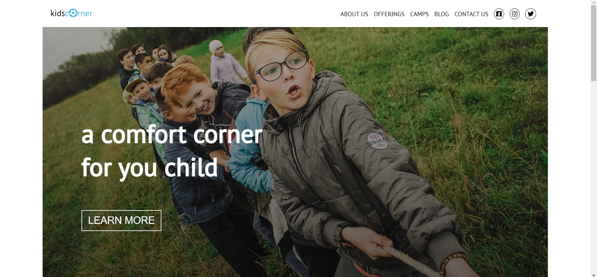
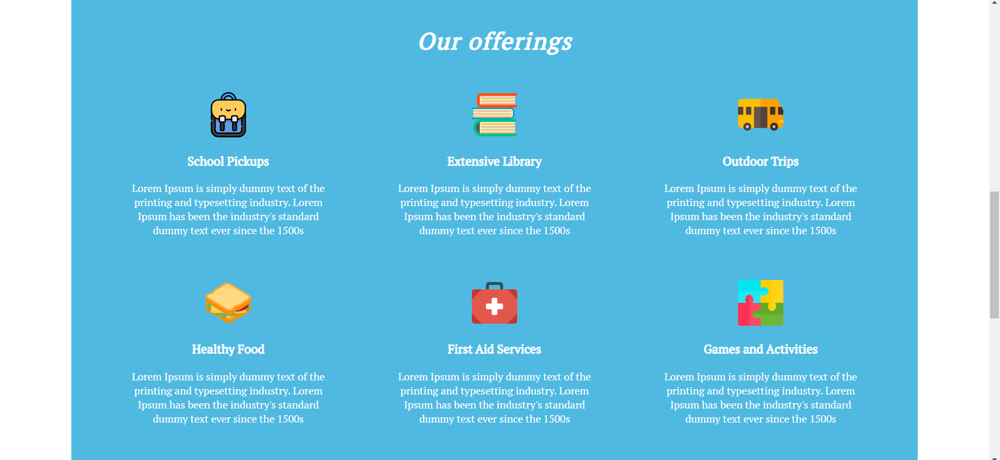

# 
<a href=https://softuni.bg/trainings/2286/html-css-mini-course> HTML & CSS Mini Course <a/>

The purpose of the course "HTML & CSS" is an initial familiarization and introduction to HTML5 and CSS3 technologies. Basic knowledge of web development, web browsers, HTML & CSS development tools is acquired and practical skills are developed using the web content description language HTML and the web content styling language CSS.

- When examining HTML, attention is paid to basic HTML tags, paragraphs, lists, tables, forms and controls, and semantic HTML tags.

- Learning CSS focuses on basic CSS selectors and styles, working with classes, presentation rules, positioning and view rules in CSS.

The course ends with a practical Workshop and building a complete page with HTML and CSS.

