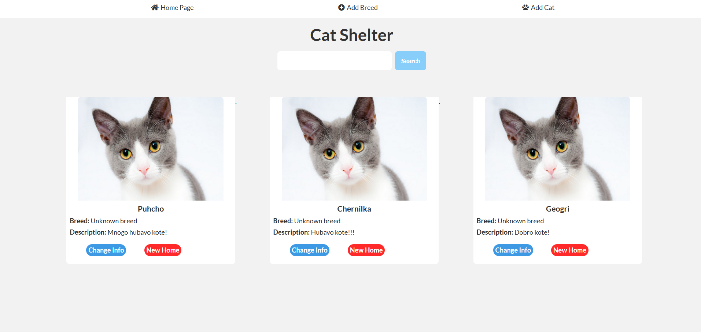

# Cat Shelter

Workshop from JS Back-End

## Technologies: 
- Node.js
  - formidable
  - qs
- HTML
- CSS

## What can the user do? - All CRUD operations
- view cats (read)
- add cat (create)
- edit cat (update)
- add breed (create)
- shelter cat (delete)
- search cat (read)

## Screenshots
